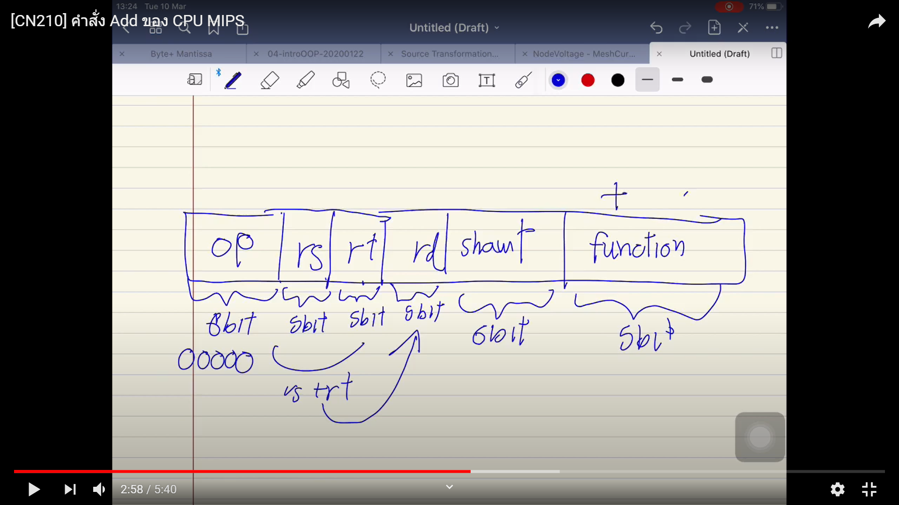
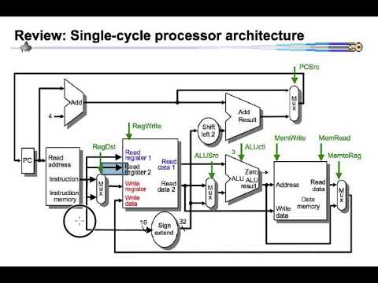
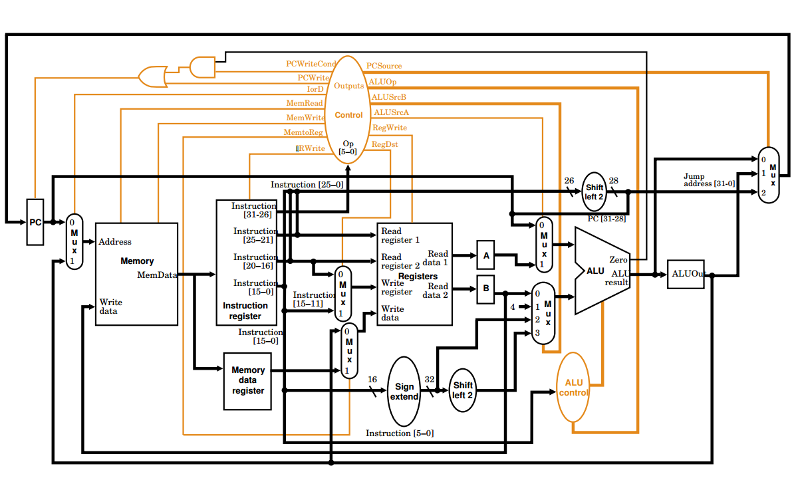
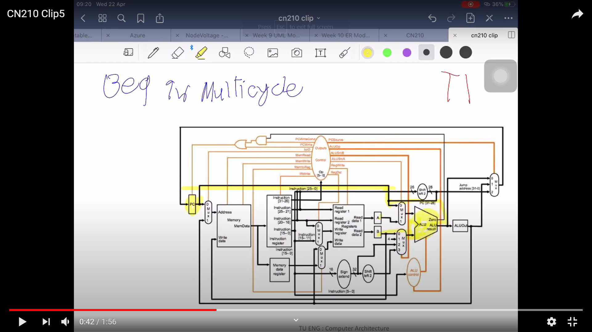
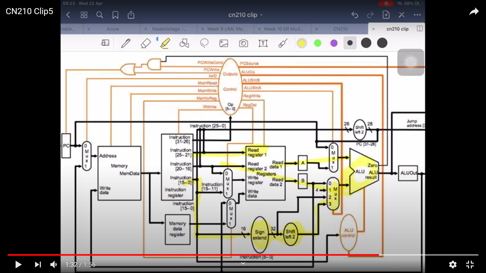
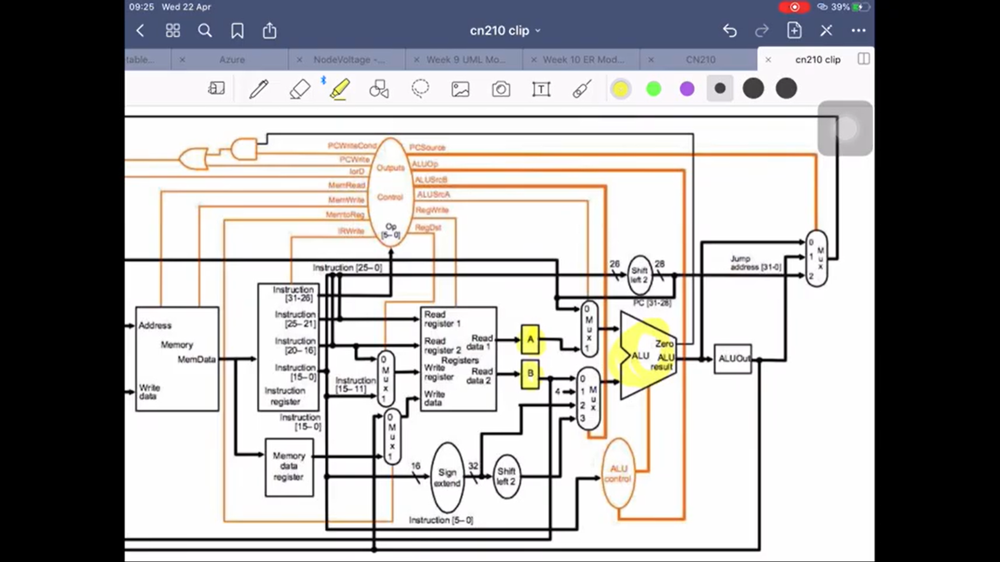
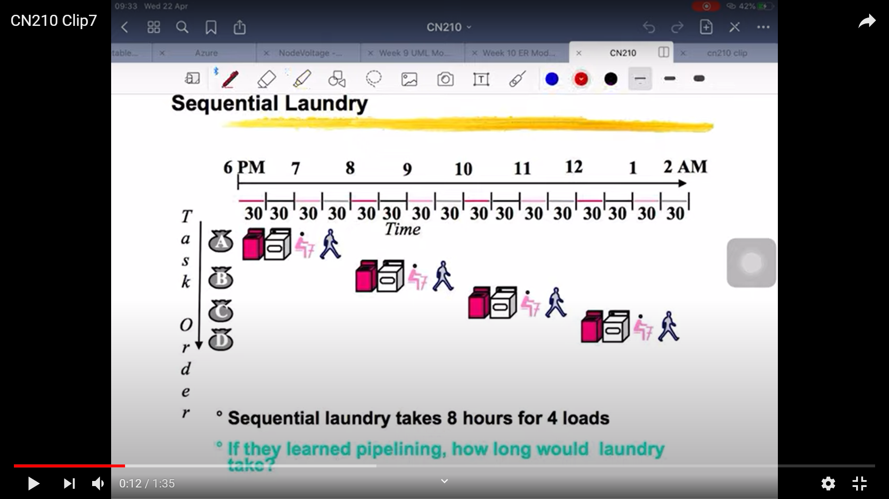

# รายงานวิชา CN210

### สรุปเนื้อหา
CPU MIPS ซึ่งเป็นหน่วยประมวลผลแบบ 32 bits มีชุดคำสั่ง 3 แบบได้แก่ 
R-Format ใช้บวกลบเช่น add และ sub , J-Format ใช้กระโดดไปที่ address และ I-Format ใช้อ่านค่าและเก็บค่าเช่น lw sw beq โดยจะมีการทำงาน 2 แบบคือ Single Cycle, Multicycle และ Pipelining 
     

#### งานครั้งที่ 1
  * [CLIP1(Youtube)](https://www.youtube.com/watch?v=XJNgUDDHLz4&t=5sk)
  
    . 
    
  ++ คำอธิบาย : คลิปนี้เกี่ยวกับคำสั่ง add ซึ่งเป็นคำสั่งประเภท R type โดยมี opcode เป็น 000000
               
#### งานครั้งที่ 2 
  * [CLIP2(Youtube)]()
  
    
    
  ++ คำอธิบาย : คลิปนี้พูดเกี่ยวกับการทำงานของ cpu ในขณะที่รันโปรแกรมภาษาคอมพิวเตอร์
  
#### งานครั้งที่ 3
  * [CLIP3(Youtube)](https://www.youtube.com/watch?v=2ExHtqbKRaQ&t=7s)
  
  SingleCycle
  
  
  
  MultiCycle
  
  
  
  ++ คำอธิบาย : คลิปนี้เกี่ยวกับความแตกต่างของ Single Cycle กับ Multicycle โดยที่ single cycle จะประมวลผลทีละขั้นตอนในขณะที่ multicycle จะสามารถทำหลายขั้นตอนพร้อมกันได้ single cycle มี ALU 3 ตัวและ memory 2 ตัวในขณะที่ multicycle จะมี ALU 1 ตัวและ memory 1 ตัว
  
#### งานครั้งที่ 4
  * [CLIP4(Youtube)](https://www.youtube.com/watch?v=XQ-GosMwBqo&t=2s)
  
      
    
  ++ คำอธิบาย : คลิปนี้พูดถึงการทำงานของคำสั่ง LW ใน cpu Multicycle โดยเริ่มต้นจากการ Fetch จะเป็นการส่งค่าให้ register และส่งค่าให้ ALU 
               เพื่อ +4 และทำstepต่อไป จากนั้นก็ทำ Fetch+1 เพื่อเก็บค่า register 2 ตัว และส่งเข้าไปที่ ALUOut จากนั้นทำการ Mem1 เป็นการส่งค่าจาก Register 
               ไปเข้า ALU เพื่อทำคำสั่งแล้วส่งให้ ALUOut หลังจากนั้นก็ส่งเข้า Memory data register
  
#### งานครั้งที่ 5
  * [CLIP5(Youtube)](https://www.youtube.com/watch?v=K4XTfzQJDPQ&t=11s)
 
    
    
    
    
    
  ++ คำอธิบาย : คลิปนี้พูดถึงการทำงานของคำสั่ง Beq ใน cpu Multicycle โดยจะเริ่มต้นจากการ Fetch จะเป็นการส่งค่าให้ register และส่งค่า
               ให้ ALU เพื่อ +4 และพร้อมทำขั้นตอนต่อไป เสร็จแล้วก็ถอดรหัสเพื่อเก็บค่าเข้า register 2 ตัว และอ่านค่า offset+pc จากนั้นก็จะส่งไปที่ ALUOut 
               หลังจากนั้นทำการเช็ค register 2 ตัวนี้ว่าเท่ากันมั้ย ถ้าเท่ากันจะส่งให้ ALUOut แต่ถ้าไม่เท่ากันก็ส่งให้ PC แทน
  
#### งานครั้งที่ 6
  * [CLIP6(Youtube)]()
  
    
  
  ++ คำอธิบาย : คลิปนี้พูดถึงการทำงาน State Machine ของ r-format ใน cpu รูปแบบ Multicycle โดยจะส่วนประกอบของการทำงานจะมีั้ง Fetch, 
               Reg/Dec, Exec, Wr โดยการทำงานจะใช้ MemRead, MemWrite, lorD, IRWrite, ALUSrcA, ALUSrcB, ALUOP, PCWrite, PCSource, RegWrite, 
               MemtoReg และ RegDst ในการทำงาน
  
  #### งานครั้งที่ 7
   * [CLIP7(Youtube)](https://www.youtube.com/watch?v=G_C4LKna9z8&t=11s)
   
      
  
  ++ คำอธิบาย : คลิปนี้พูดถึงการทำงานแบบ pipelining ซึ่งจะช่วยให้ประมวลผลเร็วขึ้นเนื่องสามารถเริ่มทำคำสั่งต่อไปในขณะที่ทำคำสั่งก่อนหน้าถึงขั้นตอนสุดท้ายช่วยย่นระยะเวลาการทำงาน
